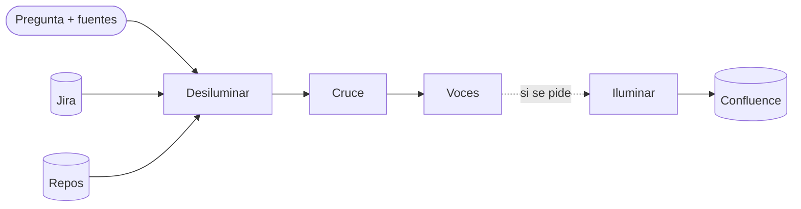

<p align="center">
  
</p>

<h1 align="center">Desiluminador</h1>

<p align="center">
  Busca información en Jira y en repos y la cuenta como historias.
</p>

---

Un desiluminador atrapa las luces de un lugar y las devuelve cuando hace falta. Este hace lo mismo con la información de un sistema: la busca en los tickets y en el código, la cruza, y la devuelve como un relato que cualquiera puede seguir. Si se pide, la guarda en la memoria del equipo.

Es una herramienta global. Se instala una vez y sirve desde cualquier repo, con cualquier agente que lea skills.

## Vocabulario

| Palabra | Qué es |
|---|---|
| **Luces** | Las informaciones. Viven en Jira, en repos, en Confluence, en internet. |
| **Desiluminar** | Buscar las luces y cruzarlas. |
| **Voces** | El reporte, en forma de historias. Claro y conciso. |
| **Iluminar** | Guardar las voces en la memoria. La memoria es Confluence. |

## Cómo funciona



1. **Encuadre.** La pregunta trae sus fuentes: claves de Jira, rutas de repos, una línea de qué es el sistema. Se identifica quién opera, porque las voces se cuentan desde esa persona.
2. **Luces de la gente.** Se leen los tickets completos: el epic, sus hijos, los enlazados, los hermanos de otros clientes. Con descripciones y comentarios en orden, con autor. Nada se resume antes de leerlo: la luz clave suele ser una frase de un comentario.
3. **Luces del código.** Un explorador por repo, de solo lectura. Cada uno sigue los flujos de punta a punta y devuelve lo que encontró con archivo y línea.
4. **Cruce.** Cada afirmación que conecte un ticket con el código se verifica. Lo que se leyó es verificado. Lo que se dedujo es inferido. Lo que vive fuera de los repos se dice.
5. **Voces.** La operación completa contada desde quien la usa, cada ticket como una historia con el mecanismo detrás, y lo que hay que saber. Sin archivos, sin líneas, sin funciones, sin hashes.
6. **Iluminar.** Las voces van a Confluence, a la carpeta **Desiluminador**, una página por pregunta.

## Uso

```
desiluminar tenemos ~/backend/api, ~/backend/core y esta app; mirá PROJ-123; la app es un punto de cobro en efectivo
```

Sale el relato en la conversación. Las repreguntas siguen ahí, con todas las luces en mano.

```
iluminar
```

Guarda las últimas voces en Confluence.

## Instalación

El repo es una skill en el formato [Agent Skills](https://agentskills.io): una carpeta con un `SKILL.md`. Se clona una sola vez en la carpeta compartida que leen varios agentes:

```sh
git clone https://github.com/guilleheizen/desiluminador.git ~/.agents/skills/desiluminador
```

Con eso ya lo ven **GitHub Copilot** y **Gemini CLI**. Para los demás, un enlace a esa misma carpeta:

| Agente | Dónde busca skills | Enlace |
|---|---|---|
| Claude Code | `~/.claude/skills/` | `ln -s ~/.agents/skills/desiluminador ~/.claude/skills/desiluminador` |
| Codex CLI | `~/.codex/skills/` | `ln -s ~/.agents/skills/desiluminador ~/.codex/skills/desiluminador` |
| Cursor | `~/.cursor/skills/` | `ln -s ~/.agents/skills/desiluminador ~/.cursor/skills/desiluminador` |
| GitHub Copilot | `~/.copilot/skills/` o `~/.agents/skills/` | Ya está. |
| Gemini CLI | `~/.gemini/skills/` o `~/.agents/skills/` | Ya está. |

Si la carpeta de skills del agente no existe, crearla antes del enlace.

Para invocarlo, en Claude Code es `/desiluminador <pregunta>` y en Codex `$desiluminador <pregunta>`. En los demás alcanza con escribir `desiluminar <pregunta>`: el agente elige la skill por su descripción.

**El explorador.** Claude Code tiene subagentes y puede correr un explorador por repo en paralelo. Para eso se registra `explorador.md` como agente:

```sh
ln -s ~/.agents/skills/desiluminador/explorador.md ~/.claude/agents/explorador.md
```

En los agentes sin subagentes no hace falta nada: el mismo agente sigue `explorador.md` para cada repo, uno por vez.

No hay config: la carpeta en Confluence se encuentra por su nombre y se crea si no existe.

## Archivos

```
desiluminador/
  SKILL.md               el método: desiluminar, voces, iluminar
  explorador.md          el explorador de repos, de solo lectura
  plantillas/encargo.md  lo que se le pide a cada explorador
  plantillas/voces.md    la forma de las voces y sus reglas de escritura
```

## Qué no hace

- No guarda nada entre preguntas ni deja archivos por su cuenta.
- No modifica ningún repo.
- No publica nada sin que se pida.
- No pone en las voces lo que sirve para seguir programando. Eso se queda en la conversación.
