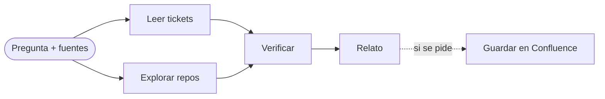

<p align="center">
  
</p>

<h1 align="center">Desiluminador</h1>

<p align="center">
  Busca información en Jira y en repos y la cuenta como historias.
</p>

---

Un desiluminador atrapa las luces de un lugar y las devuelve cuando hace falta. Este hace lo mismo con la información de un sistema: la busca en los tickets y en el código, la cruza, y la devuelve como un relato que cualquiera puede seguir. Si se pide, la guarda en la memoria del equipo.

Es una herramienta global. Se instala una vez y sirve desde cualquier repo, con cualquier agente que lea skills.

## Cómo funciona

El agente recibe una pregunta con sus fuentes y sigue el método de `SKILL.md`.



1. **Encuadre.** De la pregunta saca qué se quiere saber, las claves de Jira, las rutas de los repos con el rol de cada uno (app, backend intermedio, core, portal) y una descripción del sistema en una línea. Si esa línea falta, la deduce del README de los repos y lo dice. Identifica a la persona que opera el sistema, porque el relato se cuenta desde ella.

2. **Lectura de tickets.** Lee el ticket indicado con todos sus campos y comentarios. Si es un epic, busca sus hijos y los tickets enlazados. Si hay tickets del mismo flujo en otros clientes, también los trae. Vuelca todo a un archivo de trabajo, en orden cronológico y con autor, y lo lee completo, sin resumir. De ahí anota la cronología, quién hizo qué, qué se probó, qué quedó abierto, y las frases textuales que habrá que buscar en el código: códigos de error, etiquetas de estado, nombres de campos, valores extraños.

3. **Exploración de repos.** Lanza un explorador por repo, en paralelo si el agente tiene subagentes; si no, explora los repos de a uno. Cada explorador recibe un encargo con la pregunta, el rol del repo, los tickets en una línea, los términos textuales y preguntas específicas. Solo lee. Devuelve un reporte con archivo y línea: mapa de módulos, cada flujo paso a paso, estados y transiciones, integraciones con otros sistemas, commits recientes y cambios sin commitear, y hallazgos marcados como leídos o deducidos.

4. **Verificación.** El agente principal comprueba con grep cada afirmación que vaya a conectar un ticket con el código. Clasifica cada dato: verificado si lo leyó en el código, inferido si lo dedujo de datos o de comportamiento, no verificable si vive en una librería o en un sistema fuera de los repos. Concilia contradicciones: un ticket que dice que algo se corrigió y el código no lo contiene, un valor que QA ve y el código explica.

5. **Relato.** Escribe el reporte en la conversación con una estructura fija: qué es lo que se está mirando y una tabla de tickets; la operación completa de punta a punta, contada en presente desde quien la opera; cada ticket como una historia con el mecanismo detrás; y lo que hay que saber, separado en verificado, inferido, pendiente y encontrado en el camino. Sin nombres de archivos, líneas, funciones ni hashes: eso queda en la conversación para quien vaya a programar.

6. **Guardado en Confluence.** Solo si se pide. Busca la página **Desiluminador**, la crea si no existe, y publica el relato como una página nueva, con la fecha y la pregunta en el título. Una página por pregunta; nunca sobreescribe.

## Instalación

El repo es una skill en el formato [Agent Skills](https://agentskills.io): una carpeta con un `SKILL.md`. Se clona una sola vez en la carpeta compartida que leen varios agentes:

```sh
git clone https://github.com/guilleheizen/desiluminador.git ~/.agents/skills/desiluminador
```

Con eso ya lo ven **GitHub Copilot** y **Gemini CLI**. Para los demás, un enlace a esa misma carpeta:

| Agente | Dónde busca skills | Enlace |
|---|---|---|
| Claude Code | `~/.claude/skills/` | `ln -s ~/.agents/skills/desiluminador ~/.claude/skills/desiluminador` |
| Codex CLI | `~/.codex/skills/` | `ln -s ~/.agents/skills/desiluminador ~/.codex/skills/desiluminador` |
| Cursor | `~/.cursor/skills/` | `ln -s ~/.agents/skills/desiluminador ~/.cursor/skills/desiluminador` |
| GitHub Copilot | `~/.copilot/skills/` o `~/.agents/skills/` | Ya está. |
| Gemini CLI | `~/.gemini/skills/` o `~/.agents/skills/` | Ya está. |

Si la carpeta de skills del agente no existe, crearla antes del enlace.

Para invocarlo, en Claude Code es `/desiluminador <pregunta>` y en Codex `$desiluminador <pregunta>`. En los demás alcanza con escribir `desiluminar <pregunta>`: el agente elige la skill por su descripción.

**El explorador.** Claude Code tiene subagentes y puede correr un explorador por repo en paralelo. Para eso se registra `explorador.md` como agente:

```sh
ln -s ~/.agents/skills/desiluminador/explorador.md ~/.claude/agents/explorador.md
```

En los agentes sin subagentes no hace falta nada: el mismo agente sigue `explorador.md` para cada repo, uno por vez.

No hay config: la carpeta en Confluence se encuentra por su nombre y se crea si no existe.
