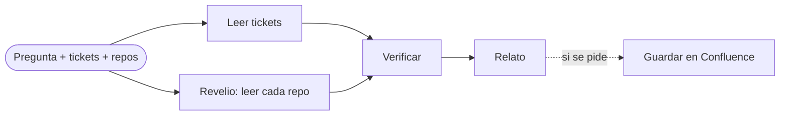

<p align="center">
  
</p>

<h1 align="center">Desiluminador</h1>

<p align="center">
  Responde preguntas sobre un sistema cruzando Jira con el código, y lo cuenta como un relato.
</p>

---

Sirve para entender un epic, un ticket, un flujo o un incidente que pasa por varios repos. Lee lo que la gente escribió en Jira, lee lo que hace el código, y marca dónde coinciden y dónde no. El resultado es un relato que cualquiera del equipo puede seguir, sepa o no programar. Si se pide, lo guarda en Confluence.

Es una herramienta global. Se instala una vez y sirve desde cualquier repo, con cualquier agente que lea skills.

## Cómo se pide

```
desiluminá PROJ-123. Repos: ~/backend/api, ~/backend/core y esta app. La app es un punto de cobro en efectivo.
```
Descripción: una pregunta o un ticket, los repos que participan y qué es el sistema en una línea. Si falta algo, lo pide en un solo mensaje antes de empezar.

También se activa con "investigá PROJ-123" o "explicame este epic". Para publicar el resultado: "guardalo en Confluence".

## Cómo funciona


```mermaid
flowchart LR
  P([Pregunta + tickets + repos]) --> T[Leer tickets]
  P --> E[Revelio: leer cada repo]
  T --> V[Verificar]
  E --> V
  V --> R[Relato]
  R -. si se pide .-> G[Guardar en Confluence]
```
Descripción: los tickets y los repos se leen en paralelo, se cruzan en la verificación, y de ahí sale el relato.

1. **Encuadre.** Saca de la pregunta qué se quiere saber, los tickets, los repos con el rol de cada uno (app, backend intermedio, core, portal) y qué es el sistema. Identifica quién usa el sistema, porque el relato se cuenta desde esa persona.

2. **Tickets.** Lee el ticket completo, con todos sus campos y comentarios. Si es un epic, trae sus hijos y los tickets enlazados. Si hay tickets del mismo flujo en otros clientes, también los trae. Anota la cronología, quién hizo qué, qué se probó, qué quedó abierto, y los textos exactos que hay que buscar en el código: códigos de error, nombres de estados, nombres de campos.

3. **Código.** Lanza un **Revelio** por repo, en paralelo si el agente puede; si no, revisa los repos de a uno. Revelio es un agente que lee el repo sin modificar nada. Recibe la pregunta, el rol del repo, los tickets y los textos a buscar. Devuelve, con archivo y línea, cada flujo paso a paso, los estados, las integraciones con otros sistemas, los cambios recientes y lo que encontró.

4. **Verificación.** Confirma en el código cada dato que une un ticket con el código. Marca cada dato como verificado (lo leyó en el código), inferido (lo dedujo) o no verificable (vive fuera de los repos). Explica las contradicciones: un ticket que dice que algo se corrigió y el código no lo tiene, un valor que QA ve y el código explica.

5. **Relato.** Lo escribe en la conversación con una estructura fija:
   - Qué es lo que se está mirando, con una tabla de tickets.
   - La operación de punta a punta, contada desde quien usa el sistema.
   - Cada ticket como una historia, con el porqué detrás.
   - Lo que hay que saber: verificado, inferido, pendiente y encontrado en el camino.

   No lleva nombres de archivos, líneas, funciones ni hashes. Ese detalle queda en la conversación para quien vaya a programar.

6. **Guardado en Confluence.** Solo si se pide. Busca la página **Desiluminador**, la crea si no existe, y publica el relato como página nueva con la fecha y la pregunta en el título. Una página por pregunta; nunca sobreescribe.

**Solo lectura.** No modifica ningún repo. Lo único que escribe es la página de Confluence, y solo si se pide.

## Archivos

| Archivo | Qué es |
|---|---|
| `SKILL.md` | El método completo |
| `revelio.md` | El agente que lee cada repo |
| `plantillas/encargo.md` | El pedido que recibe Revelio |
| `plantillas/relato.md` | La plantilla del relato y sus reglas de escritura |

## Instalación

Es una skill en el formato [Agent Skills](https://agentskills.io): una carpeta con un `SKILL.md`. Se clona una sola vez en la carpeta compartida que leen varios agentes:

```sh
git clone https://github.com/guilleheizen/desiluminador.git ~/.agents/skills/desiluminador
```
Descripción: deja la skill en `~/.agents/skills/`. Si ya tenés esta carpeta en otro lado, alcanza con un enlace: `ln -s <carpeta> ~/.agents/skills/desiluminador`.

Con eso ya la ven **GitHub Copilot** y **Gemini CLI**. Para los demás, un enlace a esa misma carpeta:

| Agente | Dónde busca skills | Enlace |
|---|---|---|
| Claude Code | `~/.claude/skills/` | `ln -s ~/.agents/skills/desiluminador ~/.claude/skills/desiluminador` |
| Codex CLI | `~/.codex/skills/` | `ln -s ~/.agents/skills/desiluminador ~/.codex/skills/desiluminador` |
| Cursor | `~/.cursor/skills/` | `ln -s ~/.agents/skills/desiluminador ~/.cursor/skills/desiluminador` |
| GitHub Copilot | `~/.copilot/skills/` o `~/.agents/skills/` | Ya está. |
| Gemini CLI | `~/.gemini/skills/` o `~/.agents/skills/` | Ya está. |

Si la carpeta de skills del agente no existe, crearla antes del enlace.

Para invocarla: en Claude Code `/desiluminador <pregunta>`, en Codex `$desiluminador <pregunta>`. En los demás alcanza con escribir `desiluminá <pregunta>`: el agente elige la skill por su descripción.

**Revelio.** Claude Code puede lanzar subagentes y correr un Revelio por repo en paralelo. Para eso se registra `revelio.md` como agente:

```sh
ln -s ~/.agents/skills/desiluminador/revelio.md ~/.claude/agents/revelio.md
```
Descripción: enlaza el archivo del agente en la carpeta de agentes de Claude Code. Si la carpeta no existe, crearla antes.

En los agentes sin subagentes no hace falta nada: el mismo agente sigue `revelio.md` para cada repo, uno por vez.

No hay configuración: la página **Desiluminador** en Confluence se encuentra por su nombre y se crea si no existe.
